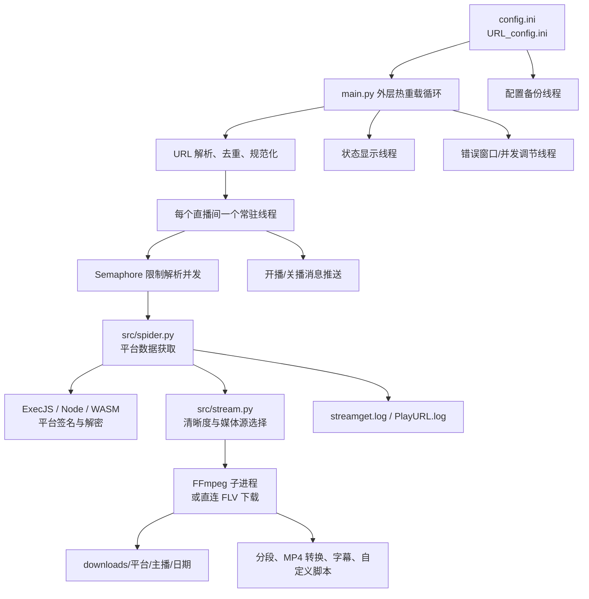

# DouyinLiveRecorder v4.0.7 源码技术架构与实现细节

> 审阅日期：2026-06-20
> 本地目录：`D:\Projects\DouyinLiveRecorder-main`
> 源码版本：v4.0.7，内容对应官方提交 `add187f8d8c7ff7d231fcbee45cbb4f1ed247d3a`

## 1. 文档范围与源码基线

当前目录是从 GitHub 下载并解压的完整源码快照，包含 36 个项目文件，但下载 ZIP 不包含 `.git` 元数据。通过逐文件 Git blob 校验和官方历史比对，可精确定位到官方提交 [`add187f8`](https://github.com/ihmily/DouyinLiveRecorder/commit/add187f8d8c7ff7d231fcbee45cbb4f1ed247d3a)，提交时间为 2025-11-03 19:55:52 +08:00，主题为“basic support for running with uv”。

源码中的 `main.py` 和 `pyproject.toml` 仍声明 v4.0.7，但它比 [`v4.0.7` 标签](https://github.com/ihmily/DouyinLiveRecorder/tree/v4.0.7)对应的 `fec734ae74aabef862996177a78c3e8cc1dcc7ee` 多三个提交：

| 提交 | 日期 | 对本源码的影响 |
|---|---|---|
| `73857755` | 2025-10-24 | 更新 TikTok 页面请求 UA、referer 和兜底 Cookie |
| `0333cb4a` | 2025-10-25 | 重构抖音 Web/App 获取路径，两个接口都加入 `a_bogus`，增强风控和 VR 空数据错误提示 |
| `add187f8` | 2025-11-03 | 新增 `pyproject.toml`，README 增加 uv、虚拟环境和镜像源说明 |

除 `src/spider.py`、`README.md`、`.gitignore` 和新增的 `pyproject.toml` 外，其余业务文件与 v4.0.7 标签内容一致；ZIP 中普遍使用 CRLF/LF 差异不视为代码变化。

## 2. 项目定位

这是一个常驻式、多直播间、多平台录制器。它周期性读取直播间列表，调用各平台网页或接口解析主播、开播状态和媒体地址，再交给 FFmpeg 录制；同时支持分段、转封装/转码、开关播通知、配置热重载、磁盘阈值退出和录制结束脚本。

本项目不是浏览器自动化录屏。绝大多数平台都走如下链路：

```text
直播间页面/分享链接
  -> 平台解析器（HTML、JSON API、GraphQL、签名算法）
  -> 统一流信息字典
  -> 清晰度和 FLV/HLS 选择
  -> FFmpeg 或直连 FLV 下载
  -> TS/FLV/MKV/MP4/MP3/M4A 文件
```

## 3. 源码目录

| 路径 | 作用 |
|---|---|
| `main.py` | 主入口、配置热重载、平台路由、录制和后处理 |
| `src/` | 平台解析、流选择、网络、代理、签名、日志和安装器 |
| `msg_push.py` | 七种消息推送实现 |
| `ffmpeg_install.py` | FFmpeg 探测与自动安装 |
| `i18n.py`、`i18n/` | gettext 运行逻辑及中文翻译文件 |
| `demo.py` | 按平台手工调用解析器的示例 |
| `config/config.ini` | 录制、推送、Cookie、登录凭据配置 |
| `config/URL_config.ini` | 监控直播间清单 |
| `src/javascript/` | 平台签名、解密、WASM 调用和 CryptoJS |
| `pyproject.toml` | PEP 621 项目元数据、Python 版本和依赖声明 |
| `requirements.txt` | 与 `pyproject.toml` 重复的 pip 依赖清单 |
| `Dockerfile`、`docker-compose.yaml` | 容器构建与运行编排 |
| `index.html` | 独立 HLS.js/flv.js 播放器 |
| `StopRecording.vbs` | Windows 停止 FFmpeg 和主进程的辅助脚本 |
| `.github/` | GitHub issue 模板、工作流等仓库元数据 |

首次运行后才会生成 `downloads/`、`logs/`、`backup_config/`；它们当前不在源码快照中。

## 4. 技术栈与版本约束

| 层 | 技术/版本 | 用途 |
|---|---|---|
| 主语言 | Python `>=3.10` | 调度、解析、网络、进程、文件和通知 |
| 项目元数据 | PEP 621 `pyproject.toml` | uv/现代 Python 工具读取项目和依赖 |
| 异步 HTTP | `httpx[http2] >= 0.28.1` | 平台接口、代理、重定向、Cookie |
| 同步 HTTP | `requests >= 2.31.0`、`urllib` | 安装器和消息推送等 |
| 日志 | `loguru >= 0.7.3` | 控制台和滚动文件日志 |
| 密码学 | `pycryptodome >= 3.20.0` | Look 等平台的 AES/RSA 处理 |
| JS 执行 | `PyExecJS >= 1.5.1` + Node.js | X-Bogus、平台签名和加解密 |
| Node.js | 未锁定版本；Docker 安装 Node 20 | ExecJS 运行时及咪咕 WASM 脚本 |
| 媒体工具 | FFmpeg，源码未锁定版本 | 拉流、复制封装、分段、音频提取、H.264 转码 |
| 容器基线 | `python:3.11-slim` + Node 20 + apt FFmpeg | Docker 运行方式 |
| 国际化 | GNU gettext `.po/.mo` | 将 `src` 包内部英文提示翻译为中文 |

`pyproject.toml` 与 `requirements.txt` 声明相同的七项直接依赖，均只有最低版本约束，没有上界；仓库也没有 `uv.lock` 或其他锁文件。因此不同时间安装可能解析到不同依赖版本。源码使用了 `str | None` 等语法，最低需要 Python 3.10。

## 5. 总体架构



## 6. 启动与常驻流程

1. 导入 `src` 时，将发布目录下的 `node/` 放入 `PATH`，执行 `check_node()`；找不到 Node 时会尝试自动安装。
2. `main.py` 将 `ffmpeg/` 放入 `PATH`，注册 `SIGTERM -> sys.exit(0)`。
3. 运行 `ffmpeg -version`。若不可用，进入自动安装逻辑；仍失败则退出。
4. 创建默认 `downloads/`，启动配置备份守护线程。
5. 对 `URL_config.ini` 做整行去重。此操作会重写文件。
6. 读取语言和代理检测设置。中文模式通过替换 `builtins.print` 对 `src` 包调用栈中的字符串执行 gettext 翻译。
7. 进入无限循环，每轮重新读取所有配置、检查磁盘空间、重新解析直播间文件，并为新 URL 创建线程。
8. 首轮额外启动状态显示线程和并发调节线程。
9. 外层循环固定休眠 3 秒，因此配置和 URL 文件近似实时生效。

如果 URL 文件为空，程序会在控制台要求输入一个直播间地址并写回文件。

## 7. 并发与状态模型

项目混合使用线程、`asyncio.run()` 和子进程：

- 每个直播间有一个 daemon 线程，在线程内部用 `asyncio.run()` 执行异步平台解析函数。
- `threading.Semaphore(max_request)` 只包围“请求平台数据/解析媒体源”阶段；FFmpeg 长连接不占用该信号量。
- 每个 FFmpeg 是独立子进程；转 MP4、字幕生成、推送和录制后脚本也可能再开线程。
- `display_info` 每 5 秒刷新控制台。
- `backup_file_start` 每 600 秒检查配置 MD5。
- `adjust_max_request` 每 5 秒依据错误窗口修改 `max_request` 数字。

主要全局状态：

| 变量 | 含义 |
|---|---|
| `recording` | 正在录制的显示名称集合 |
| `running_list` | 已创建监控线程的 URL 列表 |
| `url_comments` | 当前被 `#` 注释的 URL，用于通知工作线程停止 |
| `recording_time_list` | 录制名称到开始时间和画质的映射 |
| `need_update_line_list` | 工作线程要求主循环回写主播名/新 URL 的队列 |
| `not_record_list` | Shopee 等 URL 被替换后用于避免本轮重复创建线程 |
| `error_count`、`error_window` | 瞬时错误计数和自适应并发窗口 |
| `exit_recording` | 磁盘阈值触发后的全局停止标志 |

`recording`、`running_list`、`url_comments` 等集合没有统一锁保护；配置文件写入有 `file_update_lock`，错误计数有 `max_request_lock`。

## 8. 配置系统

配置由 `RawConfigParser` 以 `utf-8-sig` 读取。缺失 section 或 option 时，程序会写入默认值。布尔值只识别中文 `是`/`否`；其他拼写通常退回默认值。

### 8.1 录制设置

| 字段 | 类型/当前值 | 行为 |
|---|---|---|
| `language(zh_cn/en)` | `zh_cn` | 非 `en` 时启用中文 gettext |
| `是否跳过代理检测` | 否 | 启动时访问 Google 检测全局/规则代理 |
| `直播保存路径` | 空 | 空值使用程序目录下 `downloads/` |
| `保存文件夹是否以作者区分` | 是 | 增加主播目录 |
| `保存文件夹是否以时间区分` | 否 | 当前不增加日期目录 |
| `保存文件夹是否以标题区分` | 否 | 可增加标题目录 |
| `保存文件名是否包含标题` | 否 | 当前文件名不加入直播标题 |
| `是否去除名称中的表情符号` | 是 | 文件名清洗时用 `_` 替换 emoji |
| `视频保存格式...` | `ts` | 支持 FLV/MKV/TS/MP4/MP3/M4A |
| `原画|超清|高清|标清|流畅` | 原画 | 全局默认画质 |
| `是否使用代理ip` | 是 | 决定是否把配置代理传给平台请求和 FFmpeg；当前地址为空 |
| `代理地址` | 空 | 自动补 `http://` 用于 httpx 请求 |
| `同一时间访问网络的线程数` | 3 | 平台解析信号量初始容量 |
| `循环时间(秒)` | 300 | 每个直播间正常轮询间隔，另加 -5~+5 秒抖动 |
| `排队读取网址时间(秒)` | 0 | 创建相邻直播间线程之间的等待 |
| `是否显示循环秒数` | 否 | 控制台倒计时 |
| `是否显示直播源地址` | 否 | 当前不把完整媒体 URL 写入 `PlayURL.log` |
| `分段录制是否开启` | 是 | 使用 FFmpeg segment muxer |
| `是否强制启用https录制` | 否 | 将媒体 URL 的 `http://` 文本替换为 `https://` |
| `录制空间剩余阈值(gb)` | 1.0 | 低于阈值时停止录制并最终退出 |
| `视频分段时间(秒)` | 1800 | 每段约 30 分钟，关键帧等因素可能造成偏差 |
| `录制完成后自动转为mp4格式` | 是 | TS 录制结束后批量转 MP4 |
| `mp4格式重新编码为h264` | 否 | 否时只转封装；是时 `libx264 veryfast CRF 23 yuv420p` |
| `追加格式后删除原文件` | 是 | MP4 成功生成后删除原文件 |
| `生成时间字幕文件` | 否 | 每秒写一条当前时间的 SRT |
| `是否录制完成后执行自定义脚本` | 否 | 成功结束后执行配置命令 |
| `自定义脚本执行命令` | 空 | Python 脚本收到命名参数，其他命令收到位置参数 |
| `使用代理录制的平台` | 平台片段列表 | 全局开启代理时，仅匹配这些 URL 片段的请求走代理 |
| `额外使用代理录制的平台` | 空 | 即使全局代理开关关闭，匹配项仍可使用备用代理地址 |

当前组合是“执行系统代理检测、显式代理开关=是、代理地址为空”。`proxy_addr` 最终是空字符串，平台请求层会规范化为 `None`，FFmpeg 也不会插入 `-http_proxy`；海外平台能否访问主要取决于系统级全局/规则网络环境。若希望行为可预测，应填写明确的代理地址。

### 8.2 推送设置

支持 `微信`（息知兼容接口）、`钉钉`、`TG`、`邮箱`、`BARK`、`NTFY`、`PUSHPLUS`。渠道字段可同时包含多个名称；多个 webhook/token/收件人用中英文逗号分隔。

| 组 | 关键字段 |
|---|---|
| 通用 | 推送渠道、自定义标题、自定义开播内容、自定义关播内容 |
| 钉钉 | webhook、@手机号、是否@全体 |
| 微信 | 息知或兼容 JSON webhook |
| Telegram | Bot token、chat id |
| 邮箱 | SMTP host、SSL、port、登录账号、授权码、发件人、收件人 |
| Bark | API、level、sound |
| ntfy | topic URL、tags、email；通知附带直播间查看 action |
| PushPlus | token |
| 行为 | 只通知不录制、通知模式检测频率、是否发开播/关播 |

默认模板中的 `[直播间名称]` 和 `[时间]` 会被替换，字面量 `\n` 会转换为换行。开播通知在一次离线→在线变化时只发一次；检测到在线→离线后可发关播通知。

### 8.3 Cookie、Authorization 和账号密码

每个平台都有独立 Cookie 项；SOOP、FlexTV、PopkonTV、TwitCasting 支持账号密码登录。登录成功后，新的 Cookie 或 Popkon token 会直接回写 `config.ini`。

Cookie 键包括：抖音、快手、TikTok、虎牙、斗鱼、YY、B站、小红书、Bigo、Blued、SOOP、网易、千度、Panda、猫耳、Wink、Flex、Look、TwitCasting、百度、微博、酷狗、Twitch、LiveMe、花椒、流星、ShowRoom、AcFun、畅聊、音播、映客、知乎、CHZZK、嗨秀、VV、17Live、浪Live、漂漂、六间房、乐嗨、花猫、Shopee、YouTube、淘宝、京东、Faceit、咪咕、连接、来秀和 Picarto。

源码模板含非空抖音 Cookie 兜底值，且多个解析器内部还有硬编码 Cookie。本文不复制任何 Cookie、token、密码或主播 URL。`URL_config.ini` 当前为空，源码快照本身不会监控任何直播间。

## 9. `URL_config.ini` 语法与热更新

支持的行格式：

```ini
https://example/live/room
超清,https://example/live/room
https://example/live/room,主播: 自定义名称
高清,https://example/live/room,主播: 自定义名称
#https://example/live/room,主播: 暂停监控
```

处理规则：

- 支持英文逗号和中文逗号。
- 画质只接受 `原画/蓝光/超清/高清/标清/流畅`，无效值回退到原画。
- 缺协议时自动补 `https://`。
- `#` 行仍会被解析为 URL，但加入 `url_comments`，已有工作线程会据此优雅停止。
- 程序会删除重复行和重复 URL。
- 未知域名会被自动加 `#`。
- 对部分平台自动删除查询参数；小红书仅保留必要的 `host_id`。
- 首次解析到主播名后，程序会把 `,主播: 名称` 回写到原行。
- Shopee 解析器可能把分享链接更新为带 UID 的稳定地址。

文件每约 3 秒重读。因为程序会主动规范化并重写它，不应把该文件视为只读输入。

## 10. 统一流数据契约

平台解析器最终尽量产生如下字典：

```python
{
    "anchor_name": str,
    "is_live": bool,
    "title": str | None,
    "quality": "OD" | "BD" | "UHD" | "HD" | "SD" | "LD",
    "m3u8_url": str | None,
    "flv_url": str | None,
    "record_url": str | None,
    "play_url_list": list | None,
}
```

`spider.py` 负责拿到平台原始数据或初步媒体列表，`stream.py` 负责质量排序、清晰度选择和统一字段。部分简单平台直接在 `spider.py` 返回最终结构。

清晰度内部映射：

| 中文 | 代码 | 通用索引 |
|---|---:|---:|
| 原画 | OD | 0 |
| 蓝光 | BD | 0 |
| 超清 | UHD | 1 |
| 高清 | HD | 2 |
| 标清 | SD | 3 |
| 流畅 | LD | 4 |

不同平台可能按码率、分辨率、官方 qn/rate 或 HLS `BANDWIDTH` 重新映射。列表不足 5 档时，代码通常重复最后一档以避免越界。抖音/TikTok 会先检测所选 HLS URL，失败时相邻降级。

## 11. 平台适配实现

下表覆盖 `main.py` 的全部路由。平台页面/API 经常变化，函数名比具体字段路径更适合作为维护入口。

| 平台 | 入口函数/选择器 | 核心实现 |
|---|---|---|
| 抖音 | `get_douyin_web_stream_data` / `get_douyin_app_stream_data` + `get_douyin_stream_url` | PC 房间号走 `webcast/room/web/enter`；短链先解析 sec_user_id/room_id，再走 `webcast.amemv.com/.../reflow/info`；两个接口都用 Python `ab_sign()` 生成 `a_bogus`，失败后可回退页面内嵌数据；抽取 FLV/HLS 多档 |
| TikTok | `get_tiktok_stream_data` + `get_tiktok_stream_url` | 使用 Chrome 141 UA 和 referer 抓页面 `SIGI_STATE`，解析 streamData，按码率和分辨率排序；要求可访问 TikTok 的网络；未配置 Cookie 时使用源码硬编码兜底值 |
| 快手 | `get_kuaishou_stream_data` + `get_kuaishou_stream_url` | 从页面 `window.__INITIAL_STATE__` 抽取 h264 representation；备用移动 API 代码存在但主路由使用网页方案 |
| 虎牙 | `get_huya_stream_data` / `get_huya_app_stream_url` + `get_huya_stream_url` | 普通画质解析页面 stream JSON 并重算 anti-code；高档画质走小程序 API，按 TX/HW/HS/AL 选择 CDN |
| 斗鱼 | `get_douyu_info_data` + `get_douyu_stream_url` | 提取房间信息；下载网页动态 JS，经 ExecJS 执行 `ub98484234/sign`，再请求 H5 play API |
| YY | `get_yy_stream_data` + `get_yy_stream_url` | 调用 stream-manager 接口，取第一个 CDN FLV |
| B站 | `get_bilibili_room_info` + `get_bilibili_stream_url` | 获取房间、主播和状态，再按 qn 请求 `Room/playUrl`；失败时走 `getRoomPlayInfo`，高画质可能要求登录 Cookie |
| 小红书 | `get_xhs_stream_url` | 展开短链，解析 `window.__INITIAL_STATE__`，排除回放，按 room id 重建 xhscdn FLV/HLS |
| Bigo | `get_bigo_stream_url` | 解析 siteId，调用 official website studio API，读取 alive、主播、标题和 HLS |
| Blued | `get_blued_stream_url` | 从页面 `decodeURIComponent(...)` 数据恢复 JSON，读取 onLive 和 liveUrl |
| SOOP | `get_sooplive_stream_data` | 韩国站走 player API、AID/CDN 分配和可选登录；全球站走 v2 channel/stream API 与 global-media master.m3u8；支持 19+ 登录 |
| 网易 CC | `get_netease_stream_data` + `get_netease_stream_url` | 从页面状态提取直播数据，按 resolution/CDN 选择 FLV，HLS 兜底 |
| 千度热播 | `get_qiandurebo_stream_data` | 页面/API 解析后返回单一路径；录制时加 referer |
| PandaTV | `get_pandatv_stream_data` + 通用选择器 | 调 Panda API，解析 master.m3u8 并按 BANDWIDTH 排序；要求海外网络，录制时加 origin |
| 猫耳 FM | `get_maoerfm_stream_url` | 获取音频直播地址；主程序先进入音频管线，但当前控制流还会在音频结束后继续进入通用格式分支 |
| WinkTV | `get_winktv_bj_info/get_winktv_stream_data` + 通用选择器 | 查询主播/频道 API，展开 HLS 多码率；要求海外网络和 origin |
| FlexTV/TTingLive | `login_flextv/get_flextv_stream_data` | 可账号登录并回写 Cookie；处理成人内容限制，展开 HLS 清晰度 |
| Look | `get_looklive_secret_data/get_looklive_stream_url` | 通过 RSA/AES 生成接口密文并解析音频地址；主程序先进入音频管线，但当前控制流还会在音频结束后继续进入通用格式分支 |
| PopkonTV | `login_popkontv/get_popkontv_stream_url` | token 优先，失效时账号登录并回写新 token；要求海外网络和 origin |
| TwitCasting | `login_twitcasting/get_twitcasting_stream_url` | 页面/API 获取 movie id 和状态，必要时登录并回写 Cookie，通用选择器选流 |
| 百度直播 | `get_baidu_stream_data` + 通用选择器 | 从百度页面/API 取得多档 HLS 列表 |
| 微博直播 | `get_weibo_stream_data` + 通用选择器 | 解析直播页中的 HLS/FLV 多档，主路由选 `m3u8_url` |
| 酷狗 | `get_kugou_stream_url` | 调 fanxing 服务接口，返回直播状态和媒体 URL |
| Twitch | `get_twitchtv_room_info/get_twitchtv_stream_data` | 使用公开 client-id 调 GraphQL 取 playback token，再访问 usher master playlist 并按带宽排序 |
| LiveMe | `get_liveme_stream_url` | 执行 `liveme.js` 生成 `lm_s_*` 签名参数，再请求 LiveMe API；要求海外网络 |
| 花椒 | `get_huajiao_user_info/get_huajiao_stream_url_app/get_huajiao_stream_url` | 网页用户信息与 app 拉流接口互为补充；主程序强制直连 FLV 下载 |
| 流星直播 | `get_liuxing_stream_url` | 页面/API 解析主播、状态和 5see 拉流地址 |
| ShowRoom | `get_showroom_stream_data` + 通用选择器 | 解析 room id/profile 与 HLS master，多档排序 |
| AcFun | `get_acfun_sign_params/get_acfun_stream_data` | 生成设备/visitor 签名，请求 KuaishouZT 接口，按 representation 排序，偏好 FLV |
| 畅聊 | `get_changliao_stream_url` | 调移动站接口并按当前域名构造媒体地址 |
| 映客 | `get_yingke_stream_url` | 调 webapi 获取主播、状态和媒体地址 |
| 音播 | `get_yinbo_stream_url` | 调移动站接口并解析音频/视频地址 |
| 知乎 | `get_zhihu_stream_url` | 由用户页定位直播页，再请求 Zhihu API 获取状态和媒体地址 |
| CHZZK | `get_chzzk_stream_data` + 通用选择器 | 调 Naver CHZZK API，解析 playback JSON 和 HLS master；通常要求海外网络 |
| 嗨秀 | `get_haixiu_stream_url` | 执行 `haixiu.js` 对排序参数做签名，再请求服务 API |
| VV 星球 | `get_vvxqiu_stream_url` | 从分享 URL 取 roomId/platformId，请求 H5 API并返回 wasaixiu 播放地址 |
| 17Live | `get_17live_stream_url` | 调 17app API，返回主播、状态和媒体 URL；录制时加 referer |
| 浪Live | `get_langlive_stream_url` | 调 lang.live API 获取房间和播放地址 |
| 漂漂 | `get_pplive_stream_url` | 按 query 参数调用 weimipopo API |
| 六间房 | `get_6room_stream_url` | 解析 rid，调用 6.cn/6rooms 接口获取主播和拉流 URL |
| 乐嗨 | 复用 `get_haixiu_stream_url` | 根据 URL 在嗨秀/乐嗨服务域名间切换，复用同类签名协议 |
| 花猫 | 复用 `get_pplive_stream_url` | 根据 URL 在漂漂/花猫 API 间切换 |
| Shopee | `get_shopee_stream_url` | 解析短链 uid/session，调用区域直播 API；主程序强制 HTTP 和直连 FLV |
| YouTube | `get_youtube_stream_url` + 通用选择器 | 从 watch 页面/播放器 JSON 获取 HLS manifest，再解析 master playlist |
| 淘宝 | `get_taobao_stream_url` + 通用选择器 | 展开短链，取得 `_m_h5_tk`，用 `taobao-sign.js` 的 MD5 生成 MTOP sign，按 definition 排序 HLS/FLV |
| 京东 | `get_jd_stream_url` | 展开短链、提取 liveId，调用京东 API 获取直播信息和媒体 URL |
| Faceit | `get_faceit_stream_data` | 从 Faceit 玩家页取 Twitch 账号，再复用 Twitch 解析器 |
| 咪咕 | `get_migu_stream_url` | 调咪咕详情/播放 API；用 Node 执行 `migu.js`，下载官方 player WASM 计算 `ddCalcu` |
| 连接直播 | `get_lianjie_stream_url` | 调 lailianjie API，从 WebRTC 地址派生可录制 HTTP/FLV 地址 |
| 来秀 | `get_laixiu_stream_url` | Python 生成 UUID、timestamp 和 MD5 requestId，请求 imkktv API；随包 `laixiu.js` 是等价签名实现但当前 Python 路径未调用 |
| Picarto | `get_picarto_stream_url` | 调 Picarto 内部接口，构造边缘 HLS 地址 |
| 自定义源 | `main.py` 直接构造流信息 | 接受 URL 中含 `.m3u8` 或 `.flv` 的地址，不做平台解析 |

### 11.1 JavaScript 与签名组件

| 文件 | 用途 |
|---|---|
| `x-bogus.js` | 抖音 reflow URL 的 X-Bogus；混淆 VM 实现，由 ExecJS 调 `sign(query, UA)` |
| `haixiu.js` | 对参数过滤、排序、拼接并做多轮摘要，供嗨秀/乐嗨接口签名 |
| `liveme.js` | 生成随机标识、校验值、`lm_s_*` 参数和最终 MD5 签名 |
| `taobao-sign.js` | 纯 JavaScript MD5，用于 MTOP `token&t&appKey&data` 签名 |
| `migu.js` | 获取 playerVersion 和远端 `mgprtcl.wasm`，调用导出函数生成 `ddCalcu` |
| `laixiu.js` | `web + imei + timestamp + 固定盐` 的 MD5 requestId；当前 Python 已内联同类逻辑 |
| `crypto-js.min.js` | 第三方 CryptoJS 全量压缩库，供 LiveMe、嗨秀等脚本使用 |

Python `ab_sign.py` 另实现了抖音 `a_bogus`：包括 RC4、SM3、魔改 Base64 表、时间/环境字段打包和校验字节。它使用固定的伪随机浮点序列生成前缀，最终以自定义 `s4` 表编码并追加 `=`。

## 12. 媒体源选择

- 抖音和 TikTok 优先 FLV，因为通常更适合低延迟连续录制；若 URL 查询参数 `codec=h265`，退回 HLS，避免 H.265-in-FLV 兼容性问题。
- 其他平台通常使用统一 `record_url`，部分解析器明确选择 FLV。
- `enable_https_recording` 可强制把 HTTP 改成 HTTPS；Shopee 和咪咕随后又强制改回 HTTP。
- 海外域名使用更大的 FFmpeg 探测/缓冲参数。
- Panda、Wink、Popkon、Flex、千度、17Live、浪Live、Shopee、Blued 会附加特定 origin/referer。

## 13. 保存路径和命名

默认根目录为：

```text
downloads/<平台>/<主播>/<YYYY-MM-DD>/<主播>_<标题>_<YYYY-MM-DD_HH-MM-SS>_000.ts
```

具体层级由“按作者/时间/标题区分”配置组合决定。文件名会：

- 把 Windows 不允许或不适合文件名的字符、部分中文标点和空格替换成 `_`；
- 将全角括号替换为半角括号；
- 可移除 emoji；
- 清洗后为空时使用 `空白昵称`。

分段文件使用 `%03d`，超过 999 段时 FFmpeg 会继续扩展位数，不会覆盖。

## 14. FFmpeg 录制管线

公共输入参数包括：

```text
ffmpeg -y -v verbose -rw_timeout <值> -loglevel error -hide_banner
-user_agent <移动UA>
-protocol_whitelist rtmp,crypto,file,http,https,tcp,tls,udp,rtp,httpproxy
-thread_queue_size 1024
-analyzeduration <值> -probesize <值>
-fflags +discardcorrupt -re -i <媒体URL>
-bufsize <值> -sn -dn
-reconnect_delay_max 60 -reconnect_streamed -reconnect_at_eof
-max_muxing_queue_size <值>
-correct_ts_overflow 1 -avoid_negative_ts 1
```

国内默认：`rw_timeout=15,000,000`、`analyzeduration=20,000,000`、`probesize=10,000,000`、`bufsize=8000k`、mux queue 1024。海外平台分别提高到 50,000,000、40,000,000、20,000,000、15000k 和 2048。

如果配置了代理，命令前部插入 `-http_proxy <地址>`。

### 14.1 输出格式矩阵

| 格式 | 非分段 | 分段 |
|---|---|---|
| TS | 视频/音频 copy，mpegts | copy，segment + mpegts，reset timestamps |
| FLV | copy，AAC bitstream filter | copy，segment + flv |
| MKV | 视频/音频 copy，matroska | 视频 copy、音频转 AAC，segment + matroska |
| MP4 | 视频/音频 copy，mp4 | 视频 copy、音频转 AAC，fragmented mp4 segment |
| MP3 | 仅音轨，libmp3lame 320k | 同编码，segment |
| M4A | 仅音轨，AAC 320k、`aac_adtstoasc` | AAC 后按 mpegts segment 写入 `.m4a` 命名文件 |

猫耳 FM 和 Look 无论全局视频格式如何都会先走仅音频分支。该分支完成后没有 `continue/return`，还会继续落入后面的 FLV/MKV/MP4/TS 通用分支；对本身只有音频的 URL，这通常表现为第二次录制尝试或纯音轨容器，是现有控制流缺陷。Shopee 和花椒无论全局格式如何都走 Python 直连 FLV 下载器，不使用 FFmpeg 分段。

### 14.2 录制停止与收尾

`check_subprocess` 每秒检查 URL 是否被注释或磁盘停止标志：

- Windows 向 FFmpeg stdin 写入 `q`；
- Linux/macOS 发送 `SIGINT`；
- 等待进程退出，以便 FFmpeg 写完容器尾部。

FFmpeg 返回码 0 时：

1. TS 可异步转换为 MP4；
2. 可执行自定义脚本；
3. 从 `recording` 集合移除；
4. 工作线程继续等待下一次开播。

转 MP4 默认只做 `-c:v copy -c:a copy`。启用 H.264 时使用 `libx264 -preset veryfast -crf 23 -vf format=yuv420p`，音频仍 copy。

### 14.3 直连 FLV 下载器

Shopee/花椒使用 `httpx.Client(timeout=None).stream()`，每次写 16 KiB。它会附加平台 header，并在 URL 被注释时停止。该分支没有使用配置代理、没有分段、没有自动 MP4 转换，也不会自动删除失败时的部分文件。

## 15. 时间字幕

开启后，每秒追加一条 SRT：字幕内容是当时的本地时间。它不是语音识别字幕，也不是从媒体 PTS 提取的时间码。非分段 FFmpeg 录制和直连 FLV 支持该功能；音频分支被排除。

## 16. 录制完成脚本

配置命令通过 `subprocess.Popen(..., shell=True)` 执行。

如果命令字符串包含 `python`，追加：

```text
--record_name "..."
--save_file_path "..."
--save_type TS
--split_video_by_time True
--converts_to_mp4 True
```

其他命令接收主播名、文件路径、格式和两个 `key:value` 位置参数。只在 FFmpeg 返回码为 0 时运行；直连 FLV 分支不会调用它。

## 17. 消息推送实现

| 渠道 | 协议与成功判定 |
|---|---|
| 钉钉 | JSON text webhook，`errcode == 0` |
| 微信/息知 | JSON `{title, content}`，`code == 200` |
| Email | SMTP/SMTP_SSL，纯文本 MIME，多收件人 |
| Telegram | `sendMessage` Bot API，HTTP 请求成功即记成功 |
| Bark | JSON POST，`code == 200` |
| ntfy | 向 server 根路径 POST 带 topic 的 JSON，无 `error` 字段即成功 |
| PushPlus | `/send` JSON，`code == 200` |

大部分推送使用无代理的 `urllib` opener。推送在 daemon 线程中执行，不阻塞直播监控。

## 18. 日志、备份与运行数据

### 18.1 日志

- 控制台：DEBUG 以上，彩色，自带异步队列。
- `streamget.log`：排除 INFO，单文件 300 KB 轮转，retention=1。
- `PlayURL.log`：只收 INFO，记录平台、主播和完整媒体地址，同样 300 KB 轮转、retention=1。

源码目录当前没有运行日志。启用“显示直播源地址”并运行后，`PlayURL.log` 会包含带签名和过期参数的真实拉流 URL；这些 URL 虽通常短期失效，仍应视为敏感运行数据。

### 18.2 配置备份

备份线程启动后立即按 MD5 检测变化，之后每 600 秒检查：

```text
backup_config/config.ini_YYYY-MM-DD_HH-MM-SS
backup_config/URL_config.ini_YYYY-MM-DD_HH-MM-SS
```

每种源文件最多保留 6 份，按文件修改时间删除最旧版本。`config.ini` 备份会完整复制 Cookie、token 和密码。

## 19. 代理与网络层

- `ProxyDetector` 在 Windows 读取当前用户 Internet Settings 的 `ProxyEnable/ProxyServer`；Linux/macOS 读取 `http_proxy/https_proxy/ftp_proxy`。
- 实际请求代理来自 `config.ini`，系统代理检测主要用于判断海外平台分支是否应继续。
- `async_req` 每次请求创建新的 `httpx.AsyncClient`，默认 HTTP/2、20 秒超时、自动跟随 GET 重定向。
- `async_req` 默认 `verify=False`，即不验证 TLS 证书。
- 没有显式代理时，同步 `sync_req` 使用一个空 `ProxyHandler`，刻意绕过系统代理；有代理时改用 `requests`。
- 平台 Cookie 大量硬编码为兜底值，用户配置值会覆盖它们。

## 20. 安装与部署

### 20.1 Windows 源码运行与自动安装

当前源码快照不携带 Node 和 FFmpeg。导入 `src` 时会检查 Node，`main.py` 启动时会检查 FFmpeg；若系统环境中缺失：

- Node：从 nodejs.cn 页面解析版本，再从 npmmirror 下载 ZIP 到程序目录并解压为 `node/`。
- FFmpeg：从蓝奏云解析下载链接，下载固定命名的 ZIP 并解压。

### 20.2 Linux/macOS 源码运行

- Node：RedHat 系使用 NodeSource/TUNA 脚本和 yum，Debian 系使用 NodeSource 和 apt，macOS 使用 Homebrew。
- FFmpeg：尝试 yum，找不到后尝试 apt，macOS 使用 Homebrew。

### 20.3 Docker

官方 Dockerfile 使用 Python 3.11 slim，安装 Node 20、Python requirements、FFmpeg 和 tzdata，时区固定为 Asia/Shanghai。Compose 挂载 `config/`、`logs/`、`backup_config/` 和 `downloads/`，设置 `restart: always`，并打开 TTY/stdin。

### 20.4 uv 与虚拟环境

提交 `add187f8` 新增了 PEP 621 `pyproject.toml`，可使用：

```bash
uv sync
uv run main.py
```

也可用传统方式创建虚拟环境并执行 `pip install -r requirements.txt`。仓库未提供 `uv.lock`，所以 `uv sync` 仍会按当时可用的依赖版本重新解析。README 的 Bash 激活示例写成 `source .venv/Scripts/activate`，这是 Windows 虚拟环境目录；Linux/macOS 通常应使用 `source .venv/bin/activate`。

### 20.5 独立网页播放器

`index.html` 与录制主程序没有调用关系，可单独在浏览器打开。页面接受一个 M3U8 或 FLV URL：

- M3U8 优先使用 CDN 上的 `hls.js@latest`，Safari 等原生支持 HLS 的浏览器直接设置 `<video src>`；
- FLV 使用固定版本 `flv.js@1.6.2`；
- `httpToHttps()` 会在 HTTPS 页面中把输入 URL 的 `http://` 改为 `https://`，以规避混合内容限制；
- 页面没有代理、鉴权或跨域中转，播放成功仍取决于媒体服务器 CORS、referer、Cookie 和签名有效期；
- HLS.js 使用 `latest` 而非固定版本，页面行为会随 CDN 最新版本变化。

## 21. 源码模块职责

| 文件 | 主要职责 |
|---|---|
| `main.py` | 全局配置、URL 热重载、平台分派、线程管理、FFmpeg、文件命名、转码、通知触发、备份、磁盘检查 |
| `src/spider.py` | 所有平台的页面/API 请求、登录、签名调用和原始流信息解析 |
| `src/stream.py` | 通用质量映射及抖音/TikTok/快手/虎牙/斗鱼/YY/B站/网易等流选择 |
| `src/room.py` | 抖音短链、用户 sec id、unique id、web room id 和 X-Bogus |
| `src/ab_sign.py` | 抖音 a_bogus 的 RC4、SM3、自定义编码和环境数据封装 |
| `src/http_clients/async_http.py` | httpx 异步 GET/POST、重定向、Cookie、HEAD 健康检查 |
| `src/http_clients/sync_http.py` | requests/urllib 同步请求封装 |
| `src/proxy.py` | Windows 注册表和 Unix 环境变量代理探测 |
| `src/utils.py` | 配置更新、MD5、文件枚举、emoji 清理、磁盘容量、JSONP、URL query 等 |
| `src/logger.py` | Loguru 控制台与两类滚动日志 |
| `src/__init__.py` | 计算 JavaScript 路径、把随包 `node/` 加入 PATH，并在包导入时检查 Node |
| `src/initializer.py` | Node 探测和跨平台自动安装 |
| `ffmpeg_install.py` | FFmpeg 探测和跨平台自动安装 |
| `msg_push.py` | 七类通知渠道 |
| `i18n.py` | gettext 初始化并按调用栈翻译 `print` |
| `demo.py` | 每个平台单 URL 的手工解析示例；不是自动测试 |
| `pyproject.toml` | PEP 621 包元数据、`>=3.10` 约束和七项直接依赖；与 requirements 重复 |
| `index.html` | 独立的 HLS.js/flv.js 在线播放器，与主录制流程解耦 |
| `StopRecording.vbs` | WMI 查找 FFmpeg、pythonw、主 EXE，先停 FFmpeg，再延迟停主程序 |

`src/http_clients/__init__.py` 是空包标记文件，没有运行逻辑。`Dockerfile` 和 `docker-compose.yaml` 只负责容器构建/编排，业务入口仍是 `main.py`。

### 21.1 仓库自动化与模板

| 文件 | 触发与行为 |
|---|---|
| `.github/workflows/build-image.yml` | push 任意 tag 或手工触发；Buildx/QEMU 构建 `linux/amd64`、`linux/arm64`，用 Docker Hub secrets 登录，同时推送指定 tag 和 `latest` |
| `.github/workflows/issue-translator.yml` | Issue 新建或评论新建时运行 `usthe/issues-translate-action@v2.7`，非英文内容自动翻译但不改标题 |
| `.github/workflows/sync.yml` | 每天 00:00 UTC 或手工触发；仅 fork 仓库执行，使用 `MY_TARGET_SYNC_BRANCH` secret 把上游 `ihmily/DouyinLiveRecorder:main` 同步到目标分支 |
| `.github/ISSUE_TEMPLATE/*.yml` | 中英文 Bug、Feature、Question 表单，预设 `bug/enhancement/question` label |
| `.github/PULL_REQUEST_TEMPLATE.md` | 双语 PR 标题、描述、变更类型、测试和检查清单 |

仓库没有测试或 lint GitHub Actions；现有工作流只负责镜像发布、Issue 翻译和 fork 同步。`.dockerignore` 排除 Git 元数据、README、LICENSE 和镜像构建工作流，但不会排除 `config/`；Dockerfile 的 `COPY . /app` 会把配置模板带入镜像。`.gitignore` 排除 `downloads/`、`logs/`、`backup_config/`、`node/` 和 `.venv`，但不排除 `config/config.ini`。

## 22. 已识别的风险与维护注意事项

### 22.1 高优先级：凭据和隐私

1. 仓库跟踪的 `config/config.ini` 本身含明文抖音 Cookie；运行后产生的 6 份备份也会复制同样内容。
2. `PlayURL.log` 记录完整签名媒体 URL。
3. 官方源码还包含多平台硬编码示例 Cookie/会话值。
4. `config/` 未被 `.gitignore` 或 `.dockerignore` 排除，直接提交 fork 或构建镜像可能把后续填写的账号、密码、token 一并带出。

建议把整个目录视为敏感数据，不公开压缩包、配置备份和日志；轮换已经暴露的 Cookie，并把敏感配置迁移到环境变量或本机密钥存储。

### 22.2 TLS 与供应链

- 异步 HTTP 默认关闭证书校验，存在中间人攻击风险。
- Node/FFmpeg 自动下载后没有校验 SHA-256 或数字签名。
- ZIP 使用 `extractall`，没有显式防御路径穿越条目。
- Linux 自动安装通过 `shell=True` 执行远端安装脚本，要求较高权限。

### 22.3 并发与一致性

- `adjust_max_request` 修改的是整数 `max_request`，但不会重建或调整现有 `Semaphore` 容量；显示值与真实并发上限可能不同。
- 多个共享集合/列表缺少锁，存在竞态和偶发计数不一致的可能。
- 外层循环持续重建配置变量；工作线程通过全局查找读取这些新值，行为会在运行中改变。
- URL 文件会被多处主动改写。虽然写操作有锁，但外部编辑器保存与程序回写仍可能冲突。
- FFmpeg 正常结束后没有把 `record_finished` 设为真，因此注释所描述的“结束后 30 秒快速复查”主要只对直连 FLV 分支生效。

### 22.4 录制行为差异

- Shopee/花椒直连下载器不使用配置代理、不分段、不转 MP4、不执行完成脚本。
- 猫耳/Look 的音频分支结束后会继续进入通用输出分支，可能发生第二次录制尝试。
- 分段 M4A 使用 `segment_format=mpegts` 却写 `.m4a` 扩展名，容器与扩展名不一致；另有 `converts_m4a()`，但主流程没有调用它。
- 分段 FLV 后处理把含 `%03d` 的输出模板当成真实文件路径传给 `segment_video()`，路径存在检查通常失败，因而该后处理可能不执行。
- H.265 FLV 会退回 HLS，但其他容器/播放器的 HEVC 兼容性仍依赖播放器。
- `是否强制启用https录制` 是纯字符串替换，某些带签名 URL 可能因此失效。
- FFmpeg 命令中的 reconnect 布尔项没有显式 `1`，需在升级 FFmpeg 时验证参数解析兼容性。
- 注释 URL 能优雅停止 FFmpeg；直接关闭窗口或强杀进程仍可能损坏 MP4/MKV。

### 22.5 解析器脆弱性

平台适配高度依赖未公开网页结构、内部 API、固定 client-id、正则表达式和签名算法。网页字段、反爬策略、Cookie、CDN 参数或地区策略变化都会导致单个平台失效。维护时应优先在 `spider.py` 中修复数据获取，再在 `stream.py` 中修复质量选择，最后检查 `main.py` 的路由和特殊 header。

当前提交新增的抖音 Web/App 请求都依赖本地 `ab_sign()` 生成 `a_bogus`；接口返回空 `data` 时统一按“VR 不支持/风控”处理并退回空主播名，主线程随后计错并重试。TikTok 的兜底 Cookie header 是一个裸编码值，源码中没有明显的 `ttwid=` 键名；若平台要求标准 Cookie 语法，最好在配置中提供浏览器取得的完整 Cookie。

### 22.6 输入和脚本安全

- 自定义完成脚本使用 `shell=True`。只有可信人员可以修改 `config.ini`，主播名/标题等外部字符串也不应未经审计进入自定义命令。
- URL 行按所有逗号切分且没有 `maxsplit`；名称或 URL 参数中出现额外逗号可能导致解包异常。
- 主播名清洗不等价于命令行转义，不能作为 shell 安全边界。

### 22.7 停止脚本

本地 `StopRecording.vbs` 与官方源一致，但文本按 UTF-8 查看时中文提示呈乱码，表明文件编码和编辑器/WSH 代码页不一致。脚本会终止系统中所有名为 `ffmpeg.exe` 的进程，而不只限于本项目子进程；随后代码实际 `Sleep 10000`（10 秒），与提示和用户说明中的 30 秒不一致。脚本还在回退分支调用未显式 `CreateObject` 的 `objShell`；常规 WMI `Terminate()` 成功时通常不会触发，失败时回退可能无效。

### 22.8 测试与可维护性

- 项目没有单元测试或集成测试目录；`demo.py` 只是人工调用解析器。
- `main.py` 没有 `if __name__ == '__main__'` 保护，模块导入就会创建目录、检查依赖并进入无限主循环；`src/__init__.py` 导入时也会立即检查/安装 Node。这些导入副作用增加了单元测试和库化复用难度。
- `main.py` 约 2,155 行、`spider.py` 约 3,400 行，平台路由和大量全局状态集中在单文件。
- 平台返回结构缺少 TypedDict/dataclass 约束，字段错误通常运行到深层才暴露。
- `trace_error_decorator` 是同步 wrapper，却大量装饰 `async def`。wrapper 只返回 coroutine 而没有 `await`，因此通常捕获不到 coroutine 执行阶段的异常；其“记录错误并返回 `[]`”的设计对这些异步函数基本不生效。
- `async_req` 把多数网络异常转换成错误字符串返回，调用方随后再做 JSON/正则解析，首个网络原因容易被后续解析异常掩盖。
- `pyproject.toml` 和 `requirements.txt` 重复维护依赖但没有自动一致性检查，也没有 lock 文件；依赖漂移只能在运行时暴露。

## 23. 维护和排障顺序

单个平台失效时建议按以下顺序：

1. 关闭“显示直播源地址”或先保护日志，避免进一步泄露签名 URL。
2. 用官方源码 `demo.py` 单独调用该平台的 `spider` 入口，确认是页面获取、登录、签名还是字段解析失败。
3. 检查 `streamget.log` 的首个异常，而不是只看后续的字典字段异常。
4. 确认地区网络、显式代理地址、平台 Cookie 和账号状态。
5. 若 `spider` 已返回 `is_live=True`，检查 `stream.py` 选出的 `record_url`、清晰度列表和 H.265 判断。
6. 手工运行等价 FFmpeg 命令，验证 header、代理、HTTP/HTTPS 和 FFmpeg 8 参数兼容性。
7. 修复后至少验证离线、在线、开播通知、关播通知、手动注释停止、分段结束、MP4 转换和磁盘阈值。

## 24. 当前源码模板的实际行为

`config/URL_config.ini` 当前为空，因此直接运行时会先提示输入一个直播间地址。添加抖音地址后，按源码模板设置的典型结果是：

1. 每 300±5 秒检查一次离线房间；
2. 在线时优先选择原画 FLV，H.265 时改用 HLS；
3. 保存到默认 `downloads/抖音直播/<主播>/`，不增加日期目录，文件名不包含标题；
4. 以 TS 每 1,800 秒分段；
5. 直播结束或手动注释后，将相关 TS 转封装为 MP4；
6. MP4 成功后删除原 TS；
7. 默认不记录完整拉流 URL；
8. 当前推送渠道为空，不发送开关播通知；
9. 配置虽开启显式代理，但地址为空，实际不会向请求或 FFmpeg 注入代理。

## 25. 结论

项目的核心价值是覆盖面很广的平台适配层，以及围绕 FFmpeg 构建的实用常驻录制流程。架构上，它以简单的线程和全局状态换取了低上手成本，但也形成了三个主要维护压力：平台私有接口变化、明文凭据/弱 TLS 带来的安全风险、以及大型路由文件和共享状态带来的并发复杂度。

后续若继续开发，优先级建议是：先处理凭据与 TLS，再为统一流数据建立类型和契约测试，随后把平台注册表、录制器、通知器和配置热重载从 `main.py` 中拆开。
